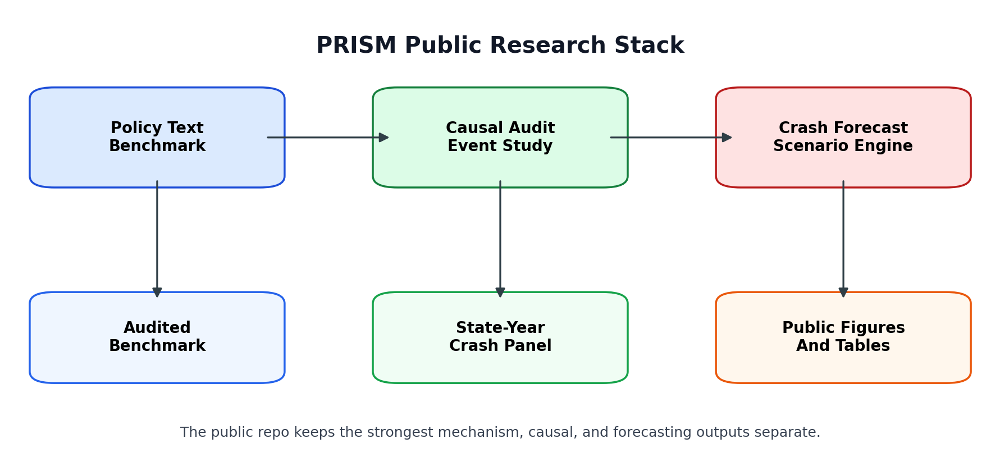
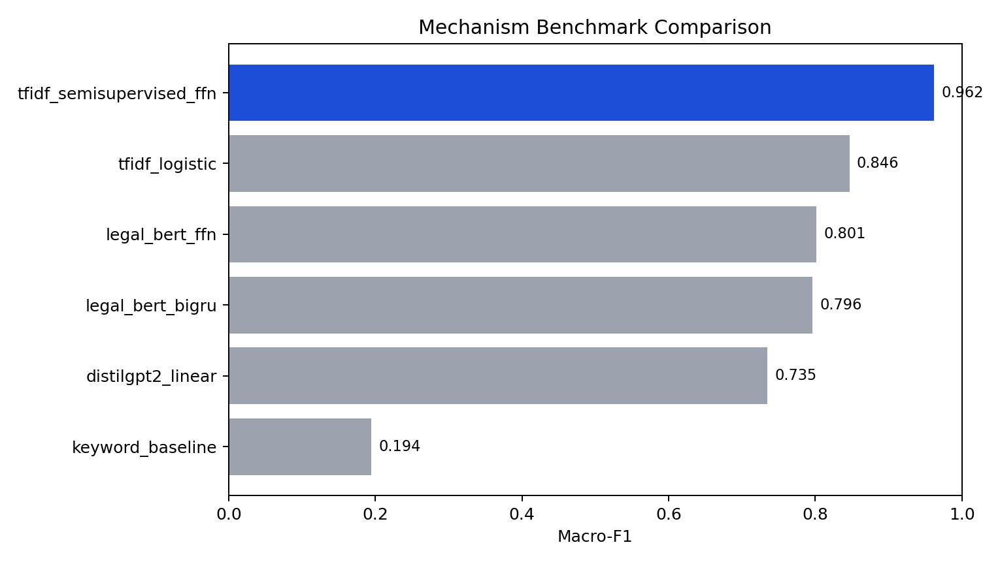
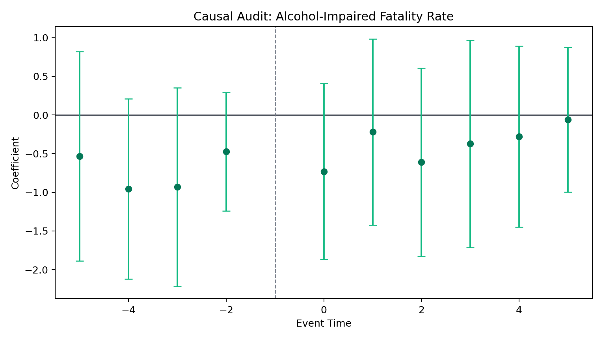
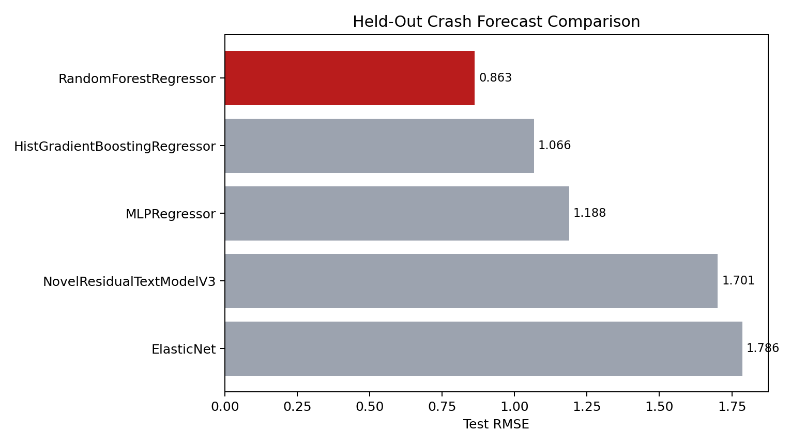
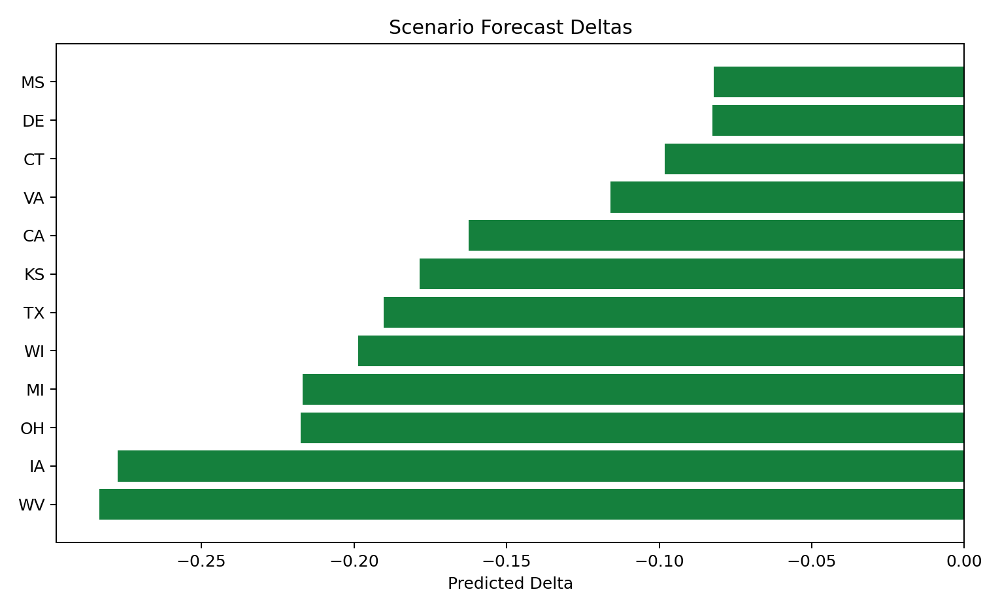

# PRISM

PRISM is a mechanism-aware AI x social science project that studies how U.S. state alcohol policy language and policy structure relate to alcohol-impaired traffic fatality risk.

## Why It Matters

Most policy studies flatten laws into binary indicators such as "changed" or "did not change." PRISM keeps the mechanism of the policy in view by separating three questions:

- What mechanism does the policy text represent: price, access, or enforcement?
- What happened historically around a clean policy event?
- What does next-year crash risk look like under a standardized scenario?

That separation is the core design choice in this repository. It keeps causal inference, text interpretation, and prediction from being conflated.

## Architecture



## Headline Findings

- Mechanism benchmark: `Macro-F1 = 0.962` on a 250-row audited benchmark, with the selected model outperforming larger pretrained baselines on this domain-specific task.
- Best crash forecaster: `RandomForestRegressor`, `RMSE = 0.863`, `R² = 0.454` on the held-out 2020-2023 test window.
- Causal audit: average post-event coefficient `-0.379` for alcohol-impaired fatality rate after first real-dollar beer-tax increases, with pretrend `p = 0.095`; the result is directional rather than definitive.

## Selected Figures









## What Is Technically Interesting Here

- The project is explicit about the difference between causal evidence and predictive performance.
- The public repo keeps a frozen audited benchmark and curated analysis artifacts instead of pretending that raw-data ingestion is the main contribution.
- The strongest text result is a domain-tuned benchmark winner, not a generic "LLM solved it" story.
- The best crash forecaster is a standard tabular model, which is a useful negative result rather than something hidden.

## Quickstart

```bash
make setup
make results
make test
```

Optional:

```bash
make demo
```

`make results` regenerates the public figures and summary tables from the curated artifacts checked into this repository.

## Repo Map

- `prism/`: public Python package for loading curated artifacts, computing headline summaries, and regenerating figures.
- `data/processed/`: frozen analysis inputs carried forward from the larger workspace.
- `results/tables/`: public benchmark, scenario, and summary tables.
- `results/figures/`: README-ready figures generated by `make results`.
- `docs/`: methodology, data, results, and limitations notes.

## Limitations And Future Work

- The policy-text coverage is not pure statute text throughout; much of the v3 coverage is supplemental and should be interpreted accordingly.
- The causal audit focuses on a small number of clean beer-tax events, so the estimate is suggestive rather than definitive.
- Scenario outputs are predictive summaries, not causal treatment effects.
- Teen-outcome work and raw-data ingestion are intentionally omitted from this public repo to keep the story focused; they remain part of the archived V2 workspace.

This repository is a cleaned public extraction from a larger internal research workspace. The goal here is clarity, not completeness.

