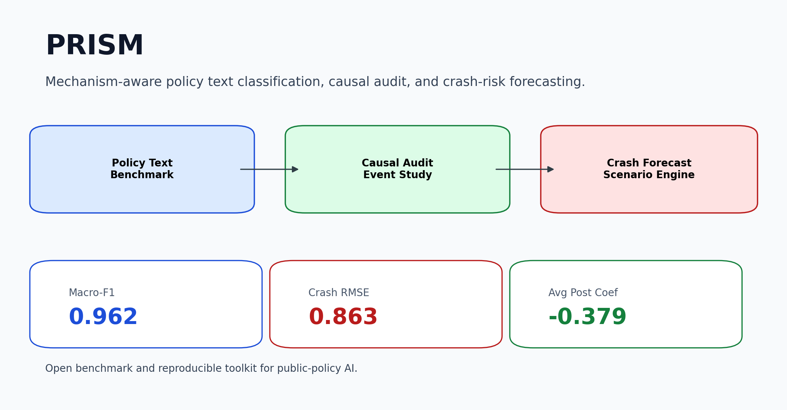

# PRISM

PRISM is an open benchmark and reproducible analysis toolkit for mechanism-aware policy text classification, causal audit, and crash-risk forecasting across U.S. states.

[Methodology](docs/methodology.md) | [Results](docs/results.md) | [Quickstart Notebook](notebooks/quickstart_prism.ipynb) | [Data Notes](docs/data.md)



## Why This Matters

- Most policy ML pipelines flatten laws into binary treatment flags; PRISM keeps the policy mechanism itself visible.
- PRISM separates what a law says, what happened around a clean policy event, and what a forecasting model predicts next.
- The repo is organized as a reusable public artifact, not a raw workspace dump: audited benchmark, curated state-year panel, public figures, and reproducible summaries.

## Headline Metrics

- Mechanism benchmark: `Macro-F1 = 0.962` on a 250-row audited benchmark.
- Best crash forecaster: `RandomForestRegressor`, `RMSE = 0.863`, `R² = 0.454` on the held-out 2020-2023 test window.
- Causal audit: average post-event coefficient `-0.379`, pretrend `p = 0.095`, framed as directional rather than definitive.

## Architecture


## Reusable Components

- Audited policy-mechanism benchmark in `data/processed/mechanism_benchmark.csv`
- Public benchmark comparison in `results/tables/mechanism_model_comparison.csv`
- Curated crash-policy state-year panel in `data/processed/panel_state_year.parquet`
- Figure-generation workflow via `make results`

## Selected Figures


## What Is Technically Interesting Here

- The project is explicit about the difference between causal evidence and predictive performance.
- The public repo keeps a frozen audited benchmark and curated analysis artifacts instead of pretending that raw-data ingestion is the main contribution.
- The strongest text result is a domain-tuned benchmark winner, not a generic "LLM solved it" story.
- The best crash forecaster is a standard tabular model, which is a useful negative result rather than something hidden.

## Quickstart

```bash
make setup
make results
make test
```

Or open the notebook:

```bash
jupyter notebook notebooks/quickstart_prism.ipynb
```

Optional:

```bash
make demo
```

`make results` regenerates the public figures and summary tables from the curated artifacts checked into this repository.

## Repo Map

- `prism/`: public Python package for loading curated artifacts, computing headline summaries, and regenerating figures.
- `data/processed/`: frozen analysis inputs carried forward from the larger workspace.
- `results/tables/`: public benchmark, scenario, and summary tables.
- `results/figures/`: README-ready figures generated by `make results`.
- `docs/`: methodology, data, results, and limitations notes.

## Limitations And Future Work

- The policy-text coverage is not pure statute text throughout; much of the v3 coverage is supplemental and should be interpreted accordingly.
- The causal audit focuses on a small number of clean beer-tax events, so the estimate is suggestive rather than definitive.
- Scenario outputs are predictive summaries, not causal treatment effects.
- Teen-outcome work and raw-data ingestion are intentionally omitted from this public repo to keep the story focused; they remain part of the archived V2 workspace.

This repository is a cleaned public extraction from a larger internal research workspace. The goal here is clarity, not completeness.
